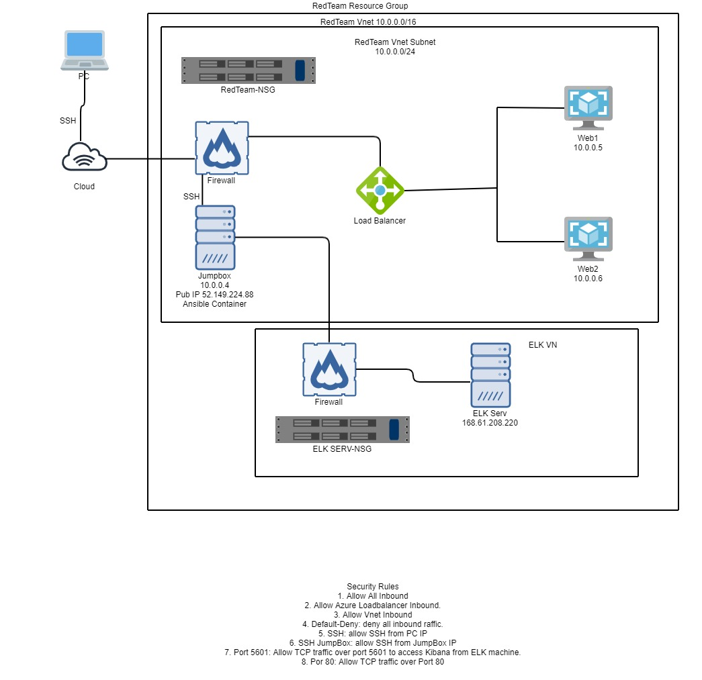

## ELK Stack Deployment
The files in this repository were used to configure the network depicted below.

Architecture Overview 

The aim of setting up this Ubuntu servers on the Azure platform is to have an environment that we as Cybersecurity students can use it to quickly deploy various virtual servers and services. This has helped us to achieve: -
 - 	Two (2) web servers configured behind an HTTP load balancer with restricted public access.
 
 - 	One (1) publicly accessible SSH bastion server (Jumpbox) that plays the role of a central management server through which access and administration of other internal servers on the internal network is achieved.
 
 -  One (1) publicly accessible ELK server through HTTP which collect and monitor system resources and logs of the two web servers.
 
**TOPOLOGY EXPLAINED**

The main aim of this network is to expose a load-balanced and monitored instance of DVWA -Damn Vulnerable Web Application.

The load balancer ensures the application remains available and restrict unauthorized access to the network. Issues as DOS (Denial of service attacks) are minimized. The Jump box limit direct access to the internal network as every access request must be authenticated.

Integrating an ELK server allows users to easily monitor the vulnerable VMs for changes to the server metrics and system logs. Two applications for doing so are Filebeat and Metricbeat. Filebeat records system logs, such as logon attempts while Metricbeat records metric data, such as CPU usage.

Using the Markdown Table Generator, the configuration details of each machine are below:

|**Name**			| **Function**	| **IP Address**		    |**Operating System**|
|---------------|---------------|-----------------------|---------------|
|RedTeam Jumpbox|  Gateway		  |10.0.0.4/52.149.224.88	|Linux Ubuntu |
|Elk-Serv			  |ELK Stack		  |168.61.208.220		      |Linux Ubuntu |
|RedTeam Web1		|VM			        |10.0.0.5			          |Linux Ubuntu |
|RedTeam Web2		|VM			|10.0.0.6|			Linux Ubuntu|

**Access Policies**

The machines on the internal network are not exposed to the public Internet.

Only the gateway machine can accept connections from the Internet. Access to this machine is only allowed from the following IP addresses:

**52.149.224.88**

Machines within the network can only be accessed by the RedTeam-Jumpbox gateway machine at 10.0.0.4.

A summary of the access policies in place can be found in the table below.

|**Name**|**Publicly Accessible**|**Allowed IP Addresses**|
|--------|-----------------------|------------------------|
|RedTeam-Jumpbox|Yes|52.149.224.88|
|ELK-SERV|Yes|168.61.208.220|
|RedTeam-Web1|No|10.0.0.5|
|RedTeam-Web2|No|10.0.0.6|

**Elk Configuration**

Ansible was used to automate configuration of the ELK machine. There was no manual configuration. This ensured consistency.

**Infrastructure as Code (easier to read & revision controlled)**

The playbook implements the following tasks:

- Configure syslog to use more memory.
- Install docker.io.
- Install python3-pip
- Install docker python module
- Install ELK Stack
- Enable Docker Service

	**Target Machines and Beats**
  
This ELK server is configured to monitor the following machines:

  - **Web 1 (10.0.0.5)**
  - **Web 2 (10.0.0.6)**

We have installed the following Beats on these machines:

  - **File beat**
  
These Beats allow us to collect the following information from each machine:

  - **File beat reads and forwards log files, and monitors file system changes.**
  
**Using the Playbook**

To use the playbook, you will need to have an Ansible control node already configured.
Assuming you have such a control node provisioned:

SSH into the control node and follow the steps below:

  - Copy the **install-elk.yml** file to **/etc/ansible.**
  - Update the **/etc/ansible/hosts** file to include **the ELK server (and the webservers)**
  - Run the playbook and navigate to **http://168.61.208.220:5601/app/kibana** to check that the installation worked as expected.
  - Which file is the playbook? Where do you copy it? **/etc/ansible/install-elk.yml**
  - Which file do you update to make Ansible run the playbook on a specific machine? How do I specify which machine to install the ELK server on versus which to install File beat on? **/etc/ansible/hosts**
  - Which URL do you navigate to in order to check that the ELK server is running? **http://168.61.208.220:5601/app/kibana**
  
  **Verify ELK is Functioning:**
  
Access the ELK Server by IP and port 5601

The following images show the easy configuration steps necessary once you've installed the beats using Docker.

Access ELK GUI to configure file beat and metric beat beats.

